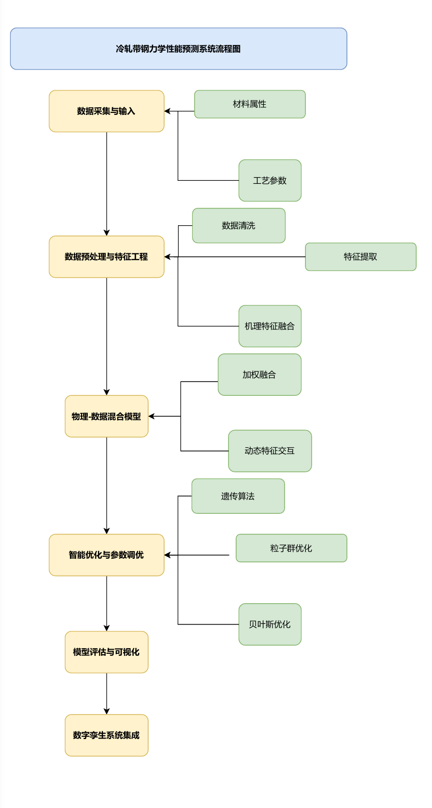

# Digital Twin-Based Product Quality Prediction in Industrial Processes

Undergraduate thesis, Northeastern University (2025) — advised by Prof. Minghai Jiao & Chang Liu.
Author: [Wei Fu](https://barryway7.github.io)

A mechanism–data fusion approach for predicting the mechanical properties (tensile strength / yield strength) of cold-rolled strip steel, achieving **R² > 0.95**, integrated into a Unity-based digital twin system for real-time industrial visualization.

## System pipeline

  

The pipeline (figure in Chinese) consists of six stages: data collection (material attributes, process parameters) → data preprocessing & feature engineering (cleaning, feature extraction, mechanism-feature fusion) → physics–data hybrid modeling (weighted fusion, dynamic feature interaction) → intelligent optimization (genetic algorithm, particle swarm, Bayesian optimization) → model evaluation & visualization → digital twin system integration.

## Method

- **Physics-informed features.** Thermodynamic and kinetic empirical models of cold rolling and annealing (e.g., grain size, dislocation density) generate mechanism features that are injected into data-driven predictors.
- **Models.** XGBoost, CatBoost, and TabTransformer benchmarked on industrial production data; hyperparameters and feature subsets tuned with evolutionary algorithms.
- **Digital twin.** A Unity-based interactive interface displays live process information and predicted mechanical properties.

## Repository contents

| File | Description |
|---|---|
| `thesis.pdf` | Full thesis (68 pages, in Chinese) |
| `defense_slides.pptx` | Thesis defense slides (June 2025) |
| `docs/pipeline.png` | System pipeline diagram |

## Results

Fusion of mechanism features with gradient-boosting models reached R² > 0.95 for both tensile strength and yield strength prediction, outperforming purely data-driven baselines. See the thesis for full experiments.
